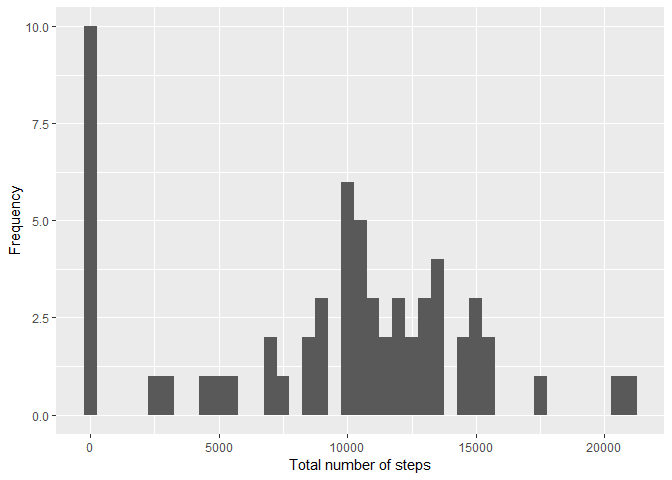
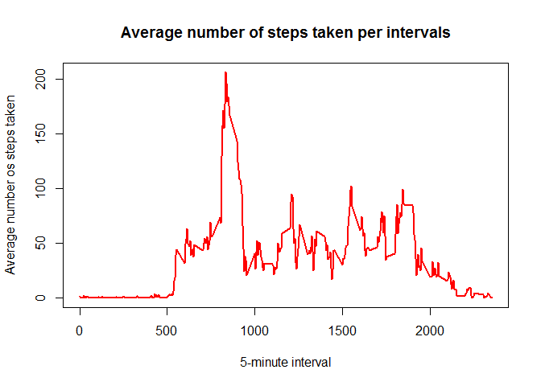
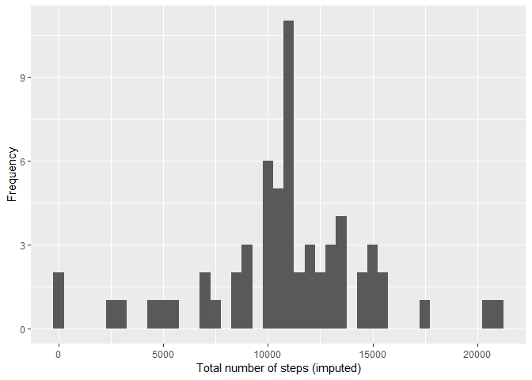
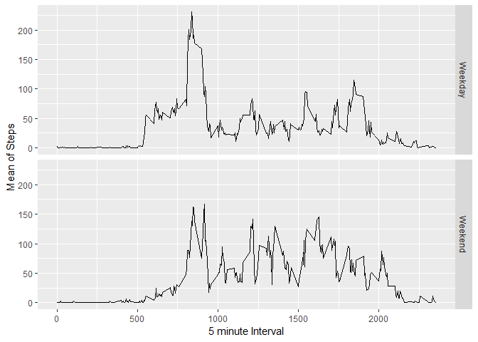

**Load packages**  


```load
library (ggplot2)
library(reshape2)
library(knitr)
```

**Download, unzip and read the file**  


```r
download.file("https://github.com/anthropovixen/RepData_PeerAssessment1/blob/master/activity.zip?raw=true"
              , destfile = "activity.zip"
              , mode = "wb")  

unzip("activity.zip"
      , exdir = ".")  

data <- read.csv("activity.csv"
                 , header = T
                 , sep = ",")  
```

**Process variables to a more suitable format**  


```r
data$date <- as.POSIXct(data$date, "%Y-%m-%d")
weekday <- weekdays(data$date)
data <- cbind(data, weekday)
```

**Clean data**  


```r
dataClean <- data[!is.na(data$steps),]
```

## 2. What is mean total number of steps taken per day?  

**Sum total steps per date**  


```r
StepsbyDay <- tapply(data$steps
                     , data$date
                     , FUN= sum
                     , na.rm = TRUE)
```

**Create the histogram of total steps per day**  

```r
ggplot2::qplot(StepsbyDay
     , xlab = "Total number of steps"
     , ylab = "Frequency"
     , binwidth = 500)
```

<!-- -->

**Here is the mean of total numbers of steps taken each day**  


```r
StepsbyDayMean <- mean(StepsbyDay)
StepsbyDayMean
```

```
## [1] 9354.23
```

**Here is the median of total numbers of steps taken each day**  


```r
StepsbyDayMedian <- median(StepsbyDay)
StepsbyDayMedian
```

```
## [1] 10395
```

## 3. What is the average daily activity pattern?  

**Calculate average of steps per intervals**  

```r
StepsbyInterval <- aggregate(data$steps
                             , by = list(data$interval)
                             , FUN = mean
                             , na.rm = TRUE)  
```

**Name columns of averaged data**  


```r
names(StepsbyInterval) <- c("Interval", "Mean")  
```

**Make a time series plot of the 5-minute interval and the average number of steps taken**  


```r
graphics::plot(StepsbyInterval$Interval
     , StepsbyInterval$Mean
     , type = "l"
     , lwd = "2"
     , col = "red"
     , xlab = "5-minute interval"
     , ylab = "Average number os steps taken"
     , main = "Average number of steps taken per intervals")  
```

<!-- -->

**Calculate which 5-minute interval contains maximum number of steps**


```r
MaxStepsInterval <- StepsbyInterval[which.max(StepsbyInterval$Mean),]
MaxStepsInterval
```

```
##     Interval     Mean
## 104      835 206.1698
```

## 4. Imputing missing values

**Calculate and report the total number of missing values in the dataset**


```r
sum(is.na(data$steps))
```

```
## [1] 2304
```

**Create object with mean values for NAs**  


```r
dataFilling <- StepsbyInterval$Mean[match(data$interval
                                          , StepsbyInterval$Interval)
                                    ]  
```

**Fill in the data with the object created, creating a dataset equal to the original**  


```r
dataFilled <- transform(data
                        , steps = ifelse(is.na(data$steps)
                                         , yes = dataFilling
                                         , no = data$steps)
                        )  
```

**Sum total steps per date**  


```r
FilledStepsbyDay <- tapply(dataFilled$steps
                           , dataFilled$date
                           , FUN = sum)
```

**Create the histogram of total steps per day with NA imputed**  


```r
ggplot2::qplot(FilledStepsbyDay
     , xlab = "Total number of steps (imputed)"
     , ylab = "Frequency"
     , binwidth = 500)
```

<!-- -->

**Here is the mean of total numbers of steps taken each day with NAs filled with means**  


```r
StepsMeanImputed <-mean(FilledStepsbyDay)
StepsMeanImputed
```

```
## [1] 10766.19
```

**Here is the median of total numbers of steps taken each day with NAs filled with means**  


```r
StepsMedianImputed <-median(FilledStepsbyDay)
StepsMedianImputed
```

```
## [1] 10766.19
```

## 5. Do these values differ from estimates from the first part of the assignment?

Yes. The mean and median values of steps taken each day change to higher values when replacing the NAs with means.

## 6. Differences in activity patterns weekdays vs weekends  

**Create variable with weekday or weekend**  


```r
dataFilled$WeekendOrWeekday <- ifelse(weekdays(as.Date(dataFilled$date))
                                      %in% c("lunes", "martes", "miércoles", "jueves", "viernes")
                                      , "Weekday", "Weekend")  
```

**Make a panel plot**  

*Add new variable to data*


```r
databyDate <- aggregate(steps ~ interval + WeekendOrWeekday
                        , data= dataFilled
                        , mean
                        , na.rm = TRUE)
```

*Create plot*


```r
library (ggplot2)
library(reshape2)
library(knitr)

ggplot2::ggplot(databyDate, aes(interval, steps)) +
geom_line () + xlab("5 minute Interval") + ylab("Mean of Steps") +  
  facet_grid(WeekendOrWeekday~.)
```

<!-- -->
